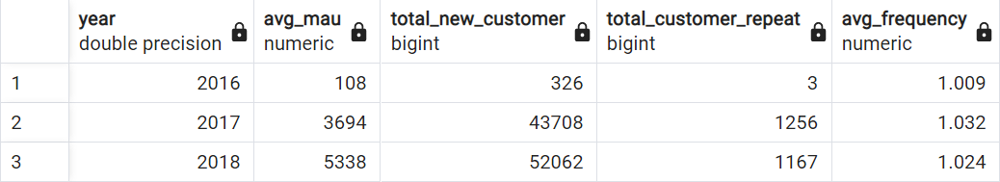
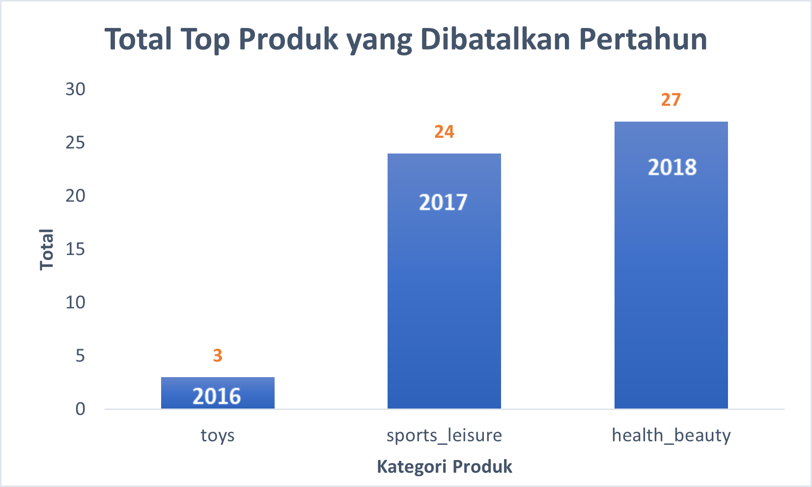
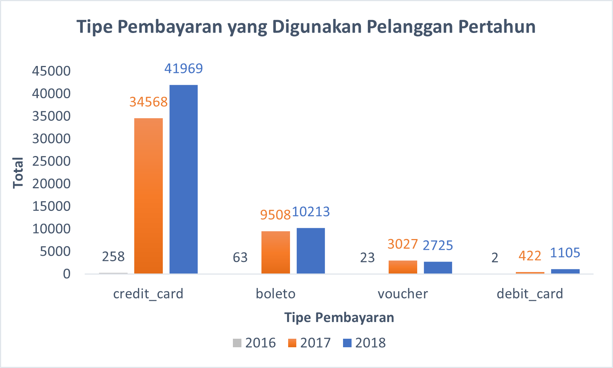

# Project Data Analysis : Analyzing eCommerce Business Performance with SQL

> 💻 Tools : **PostgreSQL**   
📈 Visualisasi : **Microsoft Excel**  
📂 Sumber Dataset : **Rakamin Academy**

## 📝 Daftar Isi
- [Rumusan Masalah](https://github.com/faizns/Analyzing-eCommerce-Business-Performance-with-SQL/edit/main/README.md#%EF%B8%8F-rumusan-masalah)
- [Objektif](https://github.com/faizns/Analyzing-eCommerce-Business-Performance-with-SQL/edit/main/README.md#%EF%B8%8F-objektif)
- [Preparasi Data](https://github.com/faizns/Analyzing-eCommerce-Business-Performance-with-SQL/edit/main/README.md#%EF%B8%8F-data-preparation)
- [Analisis](https://github.com/faizns/Analyzing-eCommerce-Business-Performance-with-SQL/edit/main/README.md#%EF%B8%8F-analisis)
- [Kesimpulan](https://github.com/faizns/Analyzing-eCommerce-Business-Performance-with-SQL/edit/main/README.md#%EF%B8%8F-kesimpulan)

## ✏️ Rumusan Masalah
Mengukur performa bisnis merupakan suatu hal yang sangat penting bagi sebuah perusahaan. Ini akan membantu dalam memantau, dan menilai keberhasilan atau kegagalan dari berbagai proses bisnis. Pengukuran performa bisnis dapat dilakukan dengan memperhitungkan beberapa metrik bisnis. Dalam poyek ini akan dilakukan analisis performa bisnis suatu perusahaan eCommerce dengan dengan metrik bisnis yaitu pertumbuhan pelanggan, kualitas produk, dan tipe pembayaran berdasarkan historical data selama tiga tahun.

## ✏️ Objektif
Mengumpulkan insight dari analisis dan dengan visualisasi berupa :
1. [**Annual Customer Activity Growth**](https://github.com/faizns/Analyzing-eCommerce-Business-Performance-with-SQL/edit/main/README.md#1-annual-customer-activity-growth)
2. [**Annual Product Category Quality**](https://github.com/faizns/Analyzing-eCommerce-Business-Performance-with-SQL/edit/main/README.md#2-annual-product-category-quality)
3. [**Annual Payment Type Usage**](https://github.com/faizns/Analyzing-eCommerce-Business-Performance-with-SQL/edit/main/README.md#3-annual-payment-type-usage)

## ✏️ Data Preparation
Dataset yang digunakan adalah dataset sebuah perusahaan eCommerce Brasil yang memiliki informasi pesanan dengan jumlah 99441 dari tahun 2016 hingga 2018. Terdapat fitur-titur yang membuat informasi seperti status pemesanan, lokasi, rincian item, jenis pembayaran, serta ulasan.

📌 Tabel yang digunakan:
- customers_dataset
- sellers_dataset
- product_dataset
- geolocation_dataset
- orders_dataset
- order_items_dataset
- order_payments_dataset
- order_reviews_dataset

📌 Langkah-langkah yang dilakukan meliputi:
1. Membuat workspace database di dalam pgAdmin dan membuat tabel menggunakan `CREATE TABLE` statement
2. Melakukan import data csv kedalam database
3. Menentukan Primary Key atau Foreign Key enggunakan statement `ALTER TABLE`
4. Membuat dan mengeksport ERD (Entity Relationship Diagram)  
[Lihat Query](https://github.com/faizns/Analyzing-eCommerce-Business-Performance-with-SQL/blob/6e872deeb0572bc9359f2cf513e0d8c32392c35a/sql_query/Create%20Table.sql)

**Hasil ERD :**  

  <kbd> </kbd>  
  Gambar 1. Entity Relationship Diagram

## ✏️ Analisis
#### 1. Annual Customer Activity Growth
Pertumbuhan aktivitas pelanggan tahunan dapat dianalisis dari Monthly active user (MAU), pelanggan baru, pelanggan dengan repeat order, dan rata-rata order oleh pelanggan. [Lihat Query](https://github.com/faizns/Analyzing-eCommerce-Business-Performance-with-SQL/blob/6e872deeb0572bc9359f2cf513e0d8c32392c35a/sql_query/Annual%20Customer%20Activity%20Growth.sql)

Tabel 1. Hasil Analisis Pertumbuhan Aktivitas Pelanggan Tahunan   
  <kbd> </kbd>  

 

  <kbd> </kbd>  
  Gambar 2. Grafik Rata-rata MAU dan Pelanggan Baru

📌 **Insight :**  
Secara keseluruhan perusahaan mengalami peningkakatan Monthly Active User serta pelanggan baru setiap tahunnya. Peningkatan yang signifikan terjadi pada tahun 2016 ke 2017, hal ini dikarenakan data transaksi pada tahun 2016 dimulai pada bulan September.  
 

  <kbd> </kbd>  
  Gambar 3. Grafik Jumlah Pelanggan yang Melakukan Repeat Order

📌 **Insight :**  
Peningkatan yang signifikan juga terjadi pada jumlah pelanggan yang melakukan repeat order pada tahun 2016 hingga 2017. Namun pada tahun 2018 mengalami sedikit penurunan, artinya diduga pelanggan kebanyakan hanya melakukan satu kali.  
 

  <kbd> </kbd>  
  Gambar 4. Grafik Rata-rata Frekuensi Order Pelanggan

📌 **Insight :**  
Dari analisis dan grafik diatas dapat dibuktikan bahwa rata-rata pelanggan setiap tahunnya memang hanya melakukan order satu kali.  
 

#### 2. Annual Product Category Quality

Kualitas kategori produk tahuan dapat dianalisis dari total pendapatan, total pembatalan pesanan, kategori top produk dan kategori produk yang paling banyak dibatalkan. [Lihat Query](https://github.com/faizns/Analyzing-eCommerce-Business-Performance-with-SQL/blob/6e872deeb0572bc9359f2cf513e0d8c32392c35a/sql_query/Annual%20Product%20Category%20Quality.sql)

  Tabel 2. Hasil Analisis Total Kategori Produk Tahunan  
  <kbd> </kbd>  

 

  <kbd> </kbd>  
  Gambar 5. Grafik Total Revenue Pertahun

📌 **Insight :**  
Secara keseluruhan revenue perusahaan meningkat setiap tahun.  
 

  <kbd> </kbd>  
  Gambar 6. Grafik Total Revenue Top Produk Pertahun

📌 **Insight :**  
Revenue yang dihasilkan dari top produk juga meningkat untuk setiap tahunnya dan setiap tahun memiliki kategori top produk yang berbeda. Tahun 2018 memiliki pendapatan revenue tertinggi dengan top produk kategori kesehatan dan kecantikan.  
 

  <kbd> </kbd>  
  Gambar 7. Grafik Total Revenue Top Produk Pertahun

📌 **Insight :**  
Produk yang sering dibatalkan oleh pelanggan untuk setiap tahunnya juga memiliki kategori yang berbeda dan mengalami kenaikan setiap tahunnya. Tahun 2018 memiliki jumlah produk yang dibatalkan paling banyak, namun disisi lain memiliki kategori yang sama dengan top produk 2018 yaitu kesehatan dan kcantikan. Hal tersebut diduga bahwa kategori kesehatan dan kecantikan sedang mendominasi pasar.   
 

#### 3. Annual Payment Type Usage
Tipe pembayaran yang digunakan pelanggan dapat dianalisis dari jenis pembayaran favorit dan jumlah penggunaan untuk setiap jenis pembayaran per tahun. [Lihat Query](https://github.com/faizns/Analyzing-eCommerce-Business-Performance-with-SQL/blob/6e872deeb0572bc9359f2cf513e0d8c32392c35a/sql_query/Annual%20Payment%20Type%20Usage.sql)

  Tabel 3. Hasil Analisis Tipe Pembayaran yang Digunakan Pelanggan  
  <kbd> </kbd>  

 

  <kbd> </kbd>  
  Gambar 8. Grafik Tipe Pembayaran yang Digunakan Pelanggan Pertahun

📌 **Insight :**  
Mayoritas pelanggan melakukan pembayaran menggunakan kartu kredit setiap tahunnya dan cenderung mengalami peningkatan, lalu disusul dengan boleto. Pembayaran menggunakan voucher meningkat pada tahun 2017, namun menurun pada tahun 2018. Hal tersebut dapat diduga karena ketersediaan voucher yang diberikan perusahaan lebih sedikit dari tahun lalu. Disisi lain, pelanggan yang melakukan pembayaran dengan kartu debit meningkat secara signifikan pada tahun 2018. Hal tersebut dapat diduga kemungkinan terdapat promosi pembayaran dengan kartu debit sehingga banyak pelanggan yang tertarik untuk menggunakan metode tersebut.

 

## ✏️ Kesimpulan

- Dilihat dari analisis pertumbuhan tahunan pelanggan dapat disimpulkan bahwa **jumlah pelanggan baru dan aktif (MAU) meningkat setiap tahunnya**, namun pelanggan cenderung tidak *repeat order* atau hanya melakukan pembelian satu kali. Dari hal tersebut perlu adanya strategi bisnis untuk meningkatkan minat pelanggan agar melakukan pembelian misalnya dengan pemberian promo, *call to action*, dan lain sebagainya.
- Dari analisis kualitas produk tahunan, **revenue terus meningkat dengan kategori produk yang berbeda setiap tahunnya**. Kategori **kesehatan dan kecantikan** atau `health_bauty` menjadi produk best seller sekaligus produk yang paling sering dibatalkan pembeliannya pada tahun 2018. Berdasarkan hasil analisis ini dapat dilakukan strategi bisnis berupa riset produk apa yang akan menjadi trend di tahun selanjutnya, sehingga diharapkan dapat memperbesar peluang perusahaan mendapatkan revenue.
- **Kartu kredit** merupakan tipe pembayaran yang dominan digunakan pelanggan.
